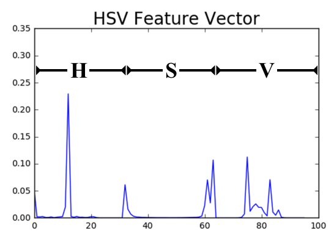
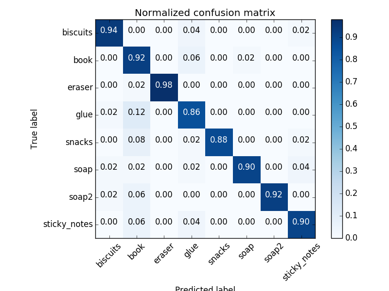
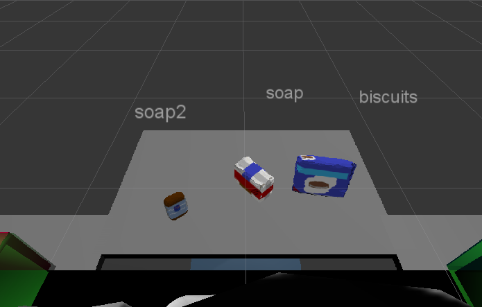
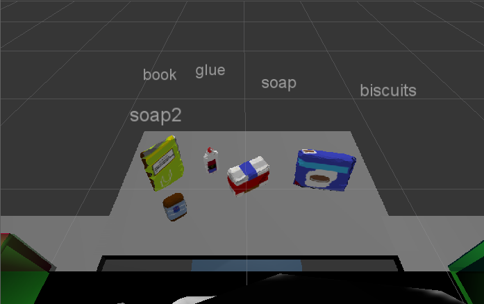
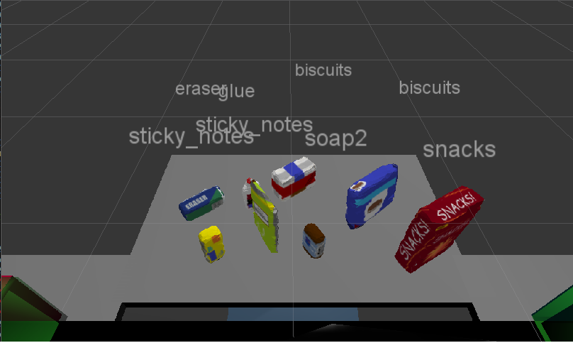

## Project: Perception Pick & Place

### Exercise 1 - Filtering
Point cloud sensors are often noisy, and contain lots of unnecessary points. This section outlines the filtering steps 
necessary to produce a robust perception pipeline.

#### Statistical Outlier Filtering
RGB-D cameras aren't perfect, and their point cloud contain random static and noise. These noisy points can appear anywhere
in the 3D space, and they have to be removed before segmentation can be run. In order to do this, I applied a technique
called Statistical Outlier Filtering. Each point is compared to its neighbors, and points that have a distance above a 
given threshold are discarded as noise. 

#### Voxel Grid Downsampling
To improve processing time, I removed points from the cloud using Voxel Grid Downsampling. The current cloud is replaced 
by averaging the points in a given area. This significantly reduces the processing workload necessary.

#### Passthrough Filtering
Passthrough filtering removes points by setting specific X, Y, and Z constraints. For example, all points outside of 
0.6 < z 0.85 are removed, and I used passthrough filtering on the Y axis to remove the bins.

#### RANSAC Filtering
Ransac filtering looks for the largest set of points that fit a single specified object. In this case, I looked for the 
largest plane to identify the table. I then removed the table from the point cloud, leaving on ly the object.

### Exercise 2 - Segmentation
Now that the point cloud data contains only the objects, it is ready for segmentation. Segmentation is the process of 
breaking a single cloud into discrete objects. Once each object is segmented, its cloud can be fed into an object 
recognition system.

#### K-Means Clustering
K-means clustering is a common segmentation algorithm for separating a known number of objects. K-means starts by 
randomly assigning centroids. Then each point is assigned to the closest centroid, and each centroid moves to the center
of all of the points that are closest to it. After enough iterations, the centers will segment the data set.

Unfortunately, k-means requires knowing the number of objects in advance, so it can't be used in this exercise.

#### DBSCAN
DBSCAN can segment an unknown number of objects. It works counting the number of neighbors each point has within a 
certain distance. If a point has more than a specified number of neighbors, it is defined as a core point. Points that 
within the range of others but without enough neighbors are considered neighbors, and the still belong to the object. 
Points with no neighbors within range are outliers, and are discarded.

DBSCAN is a great algorithm because it works for any number fo separate objects.

### Exercise 3 - Object recognition
Now that each object is segmented, the pipeline applies object recognition to determine what each object is.

#### Support Vector Machines
Support Vector Machines (SVMs) are relatively new supervised machine learning tool. They work by taking a set of features
and labels and mathematically creating decision boundaries to match new features to labels. In this project, 
I used sklearn to perform SVM analysis.

#### HSV Histogram
My perception pipeline worked by using a color histogram for each object. The HSV profile of each point was combined into
a histogram. Each histogram was a 32-bin representation of the entire HSV profile, as shown below.

#### Normal Vectors
I found that normal vectors decreased the performance of my SVM model, so I did not use them in my final project.

#### Capturing features
I sampled each object 50 times in order to create a training set. I found that 100 gave slightly better results, but 50 was much
faster to iterate on.

#### Training SVM
Here's the normalized confusion matrix produced by my SVM training. This compares the actual images with their given labels,
and ideally the diagonally would be all 1s. As you can see, this model isn't perfect, and in particular it seems to mislabel
objects as books.

### Pick and Place Setup

#### World Data
For each of the three setups, I loaded the pick list from the parameter server, then looped through each object I identified
 to find its place in the list. I calculated the centroid of each object by averaging the point in its point cloud.
 
 Each output yaml file contains all of the ros messages that would be sent to the pick place server.

#### Results
Overall, my system works pretty well. Filtering and segmentation work almost flawlessly. I spent a lot of time finding 
the right features to use, and I decided to ignore normal vectors. My system consistently mislabels objects as books, 
and adding more samples might fix that. I was surprised that using 64 bins actually decreased my performance, but that 
might change with a larger sample size.

*World 1*

*World 2*

*World 3*

 
 

